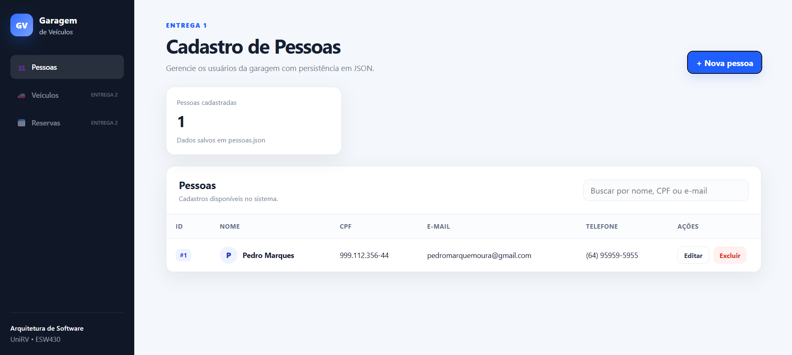
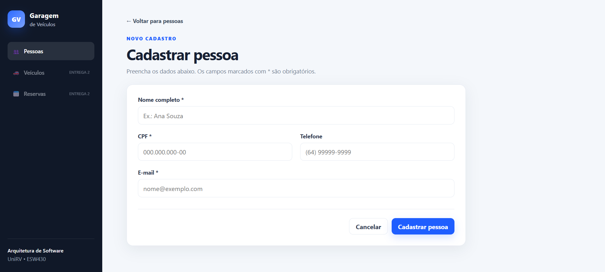
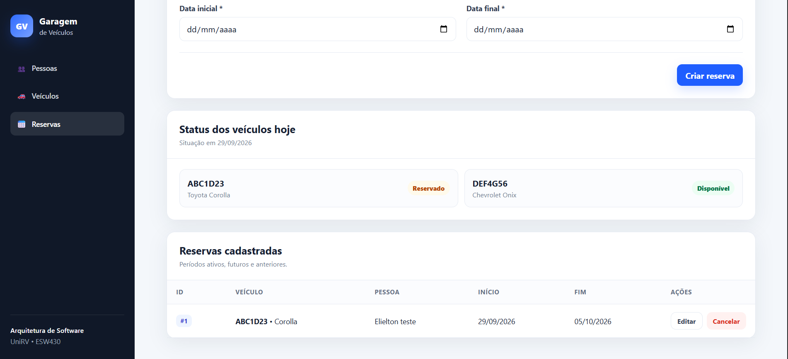
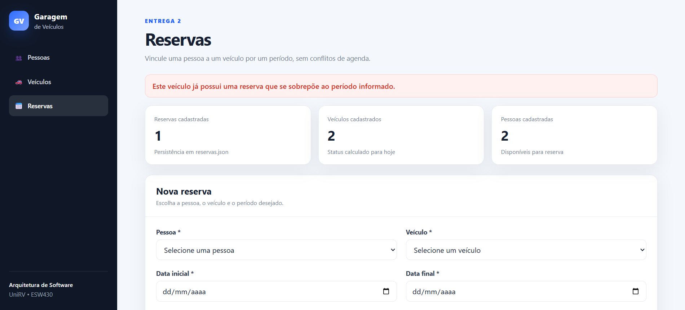

# Garagem de Veículos — Entrega 2

Atividade prática da disciplina **Arquitetura de Software — ESW430 — UniRV**.

## Sistema completo

Projeto desenvolvido em **Java 17 + Spring Boot + Thymeleaf**, aplicando:

- MVC
- Repository Pattern
- Injeção de Dependência
- Princípios SOLID
- Persistência em arquivos JSON

## Módulos

### Pessoas

- Listar, cadastrar, editar e excluir
- Nome, CPF, e-mail e telefone
- CPF único
- Persistência em `data/pessoas.json`

### Veículos

- Listar, cadastrar, editar e excluir
- Placa, marca, modelo, ano e cor
- Placa única
- Persistência em `data/veiculos.json`

### Reservas

- Página inicial do sistema
- Vincula pessoa + veículo + período
- Edita o período e os vínculos da reserva
- Cancela reserva
- Mostra cada veículo como **Disponível** ou **Reservado** na data atual
- Impede reservas sobrepostas do mesmo veículo
- Valida se pessoa e veículo existem
- Impede data final anterior à data inicial
- Persistência em `data/reservas.json`

A regra de conflito fica no `IReservaRepository` / `ReservaRepository`, e não no Controller.

## Arquitetura

```text
View → Controller → Interface → Repository → JSON
```

Estrutura principal:

```text
src/main/java/br/edu/unirv/garagem/
├── controller/
│   ├── PessoaController.java
│   ├── VeiculoController.java
│   └── ReservaController.java
├── model/
│   ├── Pessoa.java
│   ├── Veiculo.java
│   └── Reserva.java
├── repository/
│   ├── IPessoaRepository.java
│   ├── PessoaRepository.java
│   ├── IVeiculoRepository.java
│   ├── VeiculoRepository.java
│   ├── IReservaRepository.java
│   └── ReservaRepository.java
└── GaragemApplication.java
```

## Como executar

Requisitos:

- Java 17 ou superior
- Maven 3.9 ou superior

Na pasta do projeto:

```bash
mvn clean package
java -jar target/garagem-veiculos-1.0.0.jar
```

Depois acesse:

```text
http://localhost:8080
```

A página inicial é **Reservas**.

## Integrante

- **Wayser Henrique de Faria Lopes**

## Ferramentas de IA utilizadas

- **ChatGPT** — apoio na estruturação, implementação, revisão, testes e documentação do projeto.

## Prints da Entrega 1

### Listagem de Pessoas



### Formulário de Pessoa



## Prints da Entrega 2

### Página de Reservas



### Bloqueio de Reserva em Conflito

O sistema impede que o mesmo veículo receba duas reservas em períodos sobrepostos.


